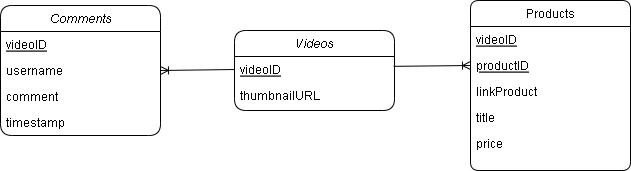

#Gigih Final Project

# Database Structure

<br>
Description** : 
The database is divided into 3 parts<br>
1.Videos<br>
2.Products<br>
3.Comments<br>

The relationship between the Products database to the Movies database is many to one.
The relationship between the Comments database to the movies database is many to one. 

# API Structure

## video
----
### Video object
```
{
  videoiId: string
  thumbnailUrl: string
}
```
### Get All Videos

- **Method**: GET
- **Endpoint**: `/video`
- Description**: Get a list of all videos along with URL thumbnail information.

#### Successful Response

- **Status**: 200 OK
- **Body**: Array of objects, each object contains video information.

#### Failed Response

- **Status**: 500 Internal Server Error
- **Body**: JSON object with key "error" containing an error message.

## Product
----
### Product object
```
{
  videoId : string
  productId: string
  link : string
  title : string
  price : double
}
```
### Get Product Based on VideoID

- **Method**: GET
- **Endpoint**: `/product/:videoId`
- Description**: Get a list of products associated with a specific video based on the VideoID.

#### Successful Response

- **Status**: 200 OK
- **Body**: Array of objects, each object contains product information.

#### Failed Response

- **Status**: 500 Internal Server Error
- **Body**: JSON object with key "error" containing an error message.

## Comment
----
### Comment object
```
{
  videoId: string
  username : string
  comment : string
  timestamp : timestamp
}
```
### Get Comments Based on VideoID

- **Method**: GET
- **Endpoint**: `/comment/:videoID`
- Description**: Gets a list of comments associated with a specific video based on the VideoID.

#### Successful Response

- **Status**: 200 OK
- **Body**: Array of objects, each object contains comment information.

#### Failed Response

- **Status**: 500 Internal Server Error
- **Body**: JSON object with key "error" containing an error message.

### Create New Comment

- **Method**: POST
- **Endpoint**: `/comment`
- Description**: Creates a new comment for a specific video.

#### Example Request
POST /comment
Content-Type: application/json
```
{
"username": "rizkyr117h",
"comment": "Good product, 5 stars!!!",
"videoID": "video1"
}
```

#### Successful Response

- **Status**: 200 OK
- **Body**: JSON object with key "success" valued true.

#### Failed Response

- **Status**: 400 Bad Request
- **Body**: The JSON object with key "error" contains an error message related to the invalid request.


#How To Run The Aplication
```
npm install // for install all depedencies
node dummy_db.js // for create database and add dummy data to database
nodemon start // run the application
```